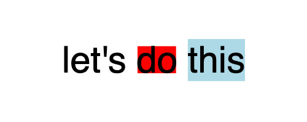
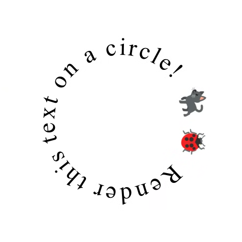

# Enhanced TextMetrics

**Status**: explainer.

## Goals

Extend the capabilities of `TextMetrics` to support selection rectangles and bounding box queries over character ranges. This would additionally enable precise caret positioning.

## Rationale

Users should be able to interact with canvas-based text input that correctly renders selection and caret positions.

All metrics available through DOM APIs should also be available on `measureText()`. Furthermore, `measureText()` will always be limited to a single style, and therefore has the potential to be slightly faster (as it doesn’t need layout). `measureText()` must return the same values as the equivalent DOM APIs.

We also want to provide more power to current canvas text rendering APIs.

## Proposal

```webidl
dictionary TextClusterOptions {
  CanvasTextAlign align;
  CanvasTextBaseline baseline;
  double x;
  double y;
};

[Exposed=(Window,Worker)]
interface TextCluster {
    readonly attribute double x;
    readonly attribute double y;
    readonly attribute unsigned long start;
    readonly attribute unsigned long end;
    readonly attribute DOMString align;
    readonly attribute DOMString baseline;
};

[Exposed=(Window,Worker)] interface TextMetrics {
  // ... extended from current TextMetrics.
  
  sequence<DOMRectReadOnly> getSelectionRects(unsigned long start, unsigned long end);
  DOMRectReadOnly getActualBoundingBox(unsigned long start, unsigned long end);
  sequence<TextCluster> getTextClusters(optional TextClusterOptions options);
  sequence<TextCluster> getTextClusters(unsigned long start, unsigned long end, optional TextClusterOptions options);

  unsigned long getIndexFromOffset(double offset);
};

interface CanvasRenderingContext2D {
    // ... extended from current CanvasRenderingContext2D.

    void fillTextCluster(TextCluster textCluster, double x, double y, optional TextClusterOptions options);
    void strokeTextCluster(TextCluster textCluster, double x, double y, optional TextClusterOptions options);
};
```

`getSelectionRects()` returns the set of rectangles that the UA would render as selection to select a particular character range.

`getActualBoundingBox()` returns an equivalent box to `TextMetrics.actualBoundingBox`, i.e., the bounding rectangle for the drawing of that range. Notice that this can be (and usually is) different from the selection rect, as those are about the flow and advance of the text. A font that is particularly slanted or whose accents go beyond the flow of text will have a different paint bounding box. For example: if you select this: ***W*** you will see that the end of the W is outside the selection area, which would be covered by the paint (actual bounding box) area.

The `getIndexFromOffset` method returns the strign indext for the character at the given `offset` distance from the start position of the text run (accounting for `textAlign` and `textBaseline`) with offset always increasing
left to right (so negative offsets are valid). Values to the left or right of the text bounds will return 0 or
`string.length` depending on the writing direction. The functionality is similar but not identical to [`document.caretPositionFromPoint`](https://developer.mozilla.org/en-US/docs/Web/API/Document/caretPositionFromPoint). In particular, there is no need to return the element containing the caret and offsets beyond the boundaries of the string are acceptable.

`getTextClusters()` provides the ability to render minimal grapheme clusters (in conjunction with a new method for the canvas rendering context, more on that later). That is, for the character range given as in input, it returns the minimal rendering operations broken down as much as logically possible, with their corresponding positional data. The position is calculated with the original anchor point for the text as reference, while the `align` and `baseline` parameters in the options dictionary determine the desired alignment of each cluster. If no options dictionary is passed, these values are taken from the same as the ones used for the anchor point. If no range is passed, the whole text gets split into clusters.

To actually render these clusters on the screen, two new methods for the rendering context is proposed: `fillTextCluster()` and `strokeTextCluster()`. They renders the cluster with the `align` and `baseline` stored in the object, ignoring the values set in the context. Additionally, to guarantee that the rendered cluster is accurate with the measured text, the rest of the `CanvasTextDrawingStyles` must be applied as they were when `ctx.measureText()` was called, regardless of any changes in these values on the context since. Note that to guarantee that the shaping of each cluster is indeed the same as it was when measured, it's necessary to use the whole string as context when rendering each cluster.

To enable additional flexibility, an options dictionary can be passed to `fillTextCluster()` and `strokeTextCluster()` to override the values for `align`, `baseline`, `x`, and `y` that will be used to render that cluster. For example, calling `ctx.fillTextCluster(cluster, 10, 10, {x: 0, y:0})` will render the cluster exactly at position `(10, 10)`, instead of rendering as if the text as a whole was placed at `(10, 10)` (which is what the internal `x` and `y` values of the cluster represent). This same overriding applies to the `align` and `baseline` parameters if they are passed in the options dictionary. These options passed to `fillTextCluster()` don't modify the underlying cluster object, and only apply to the rendering of that specific call.

For `align` specifically, the position is calculated in regards of the advance of said grapheme cluster in the text. For example: if the `align` passed to the function is `center`, for the letter **T** in the string **Test**, the position returned will be not exactly be in the middle of the **T**. This is because the advance is reduced by the kerning between the first two letters, making it less than the width of a **T** rendered on its own.

`getSelectionRects()`, `getActualBoundingBox()`, and `getTextClusters()` operate in character ranges and use positions relative to the text’s origin (i.e., `textBaseline`/`textAlign` is taken into account).

`getIndexFromOffset()` is recent rename. The previous name was `caretPositionFromPoint()` and is available in Chrome Canary from version `128.0.6587.0`.

## Example usage

```js
const canvas = document.querySelector('canvas');
const ctx = canvas.getContext("2d");

const textMetrics = ctx.measureText("let's do this");
ctx.fillStyle = 'red';
const boxForSecondWord = textMetrics.getActualBoundingBox(6, 8);
ctx.fillRect(
    boxForSecondWord.x,
    boxForSecondWord.y,
    boxForSecondWord.width,
    boxForSecondWord.height,
);
const selectionForThirdWord = textMetrics.getSelectionRects(9, 13);
ctx.fillStyle = 'lightblue';
for (const s of selectionForThirdWord) {
    ctx.fillRect(s.x, s.y, s.width, s.height);
}
ctx.fillStyle = 'black';
ctx.fillText("let's do this");
```

Expected output:



`getSelectionRects()` and `getActualBoundingBox()` can be used on Chrome Canary (starting from version `127.0.6483.0` and `128.0.6573.0` respectively) by enabling the feature with `--enable-features=ExtendedTextMetrics` (or the general `--enable-experimental-web-platform-features`). 

```js
const canvas = document.getElementById('canvas');
const ctx = canvas.getContext('2d');

ctx.font = '60px serif';
ctx.textAlign = 'left';
ctx.textBaseline = 'middle';

const text = 'Colors 🎨 are 🏎️ fine!';
let tm = ctx.measureText(text);
let clusters = tm.getTextClusters();

const colors = ['orange', 'navy', 'teal', 'crimson'];
for(let cluster of clusters) {
    ctx.fillStyle = colors[cluster.begin % colors.length];
    ctx.fillTextCluster(cluster, 0, 0);
}
```

Expected output:


```js
const canvas = document.getElementById("canvas");
const ctx = canvas.getContext('2d');

const center_x = 250;
const center_y = 250;
const radius = 150;
ctx.font = '50px serif';
ctx.textAlign = 'left';
let text = "🐞 Render this text on a circle! 🐈‍⬛";

const tm = ctx.measureText(text);
// We want the x-position of the center of each cluster. 
const clusters = tm.getTextClusters({align: 'center'});

for (const cluster of clusters) {
    // Since ctx.textAlign was set to 'left' before measuring, all values of
    // cluster.x are positive.
    let p = cluster.x / tm.width;
    let rad = 2 * Math.PI * p;
    let x = radius * Math.cos(rad) + center_x;
    let y = radius * Math.sin(rad) + center_y;
    ctx.save();
    ctx.translate(x, y);
    ctx.rotate(rad + Math.PI / 2);
    ctx.translate(-x, -y);
    // The cluster is rendered at precisely (x, y), using align as 'center'
    // and baseline as 'middle', even if different values were used when
    // measuring.
    ctx.fillTextCluster(cluster, x, y,
        {align: 'center', baseline: 'middle', x: 0, y: 0});
    ctx.restore();
}
```

Expected output:



`getTextClusters()` and `fillTextCluster()` can be used on Chrome Canary (starting from version `132.0.6783.0`) by enabling the feature with `--enable-features=ExtendedTextMetrics` (or the general `--enable-experimental-web-platform-features`). `strokeTextCluster()` is available in Chrome Canary from version `135.0.7039.0`.

## Alternatives and Open Questions

